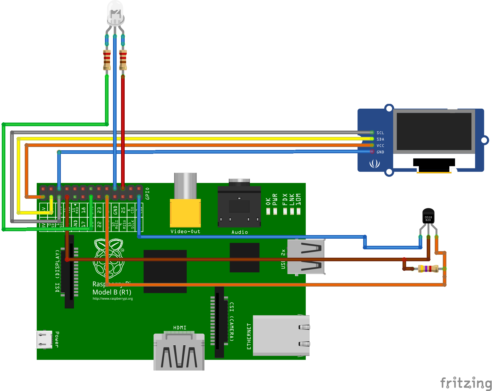

# rpi_oled_128x32_ssd1306

Check minimal configuration of OLED display with 128x32 size based on SSD1306

Hardware configuration

It is necessary to aligh into a code following line

fd = open("/sys/bus/w1/devices/28-051700dadeff/w1_slave", O_RDONLY);

which depends on connected one wire device and serial number
